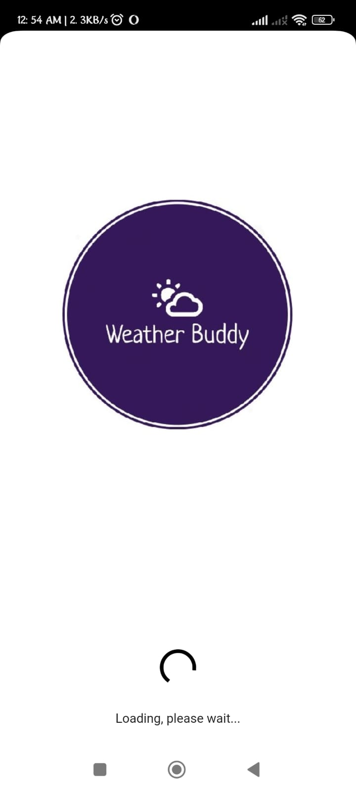
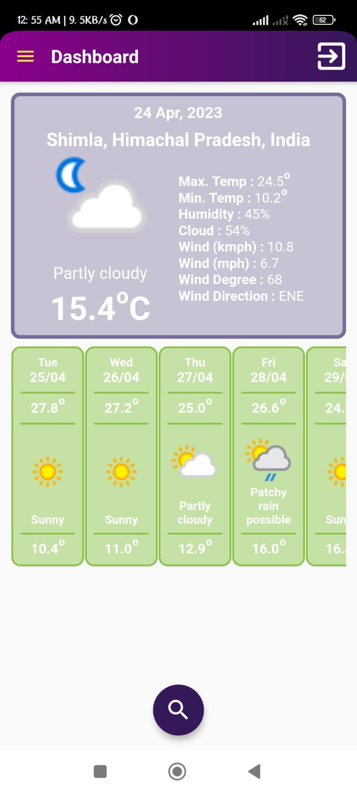
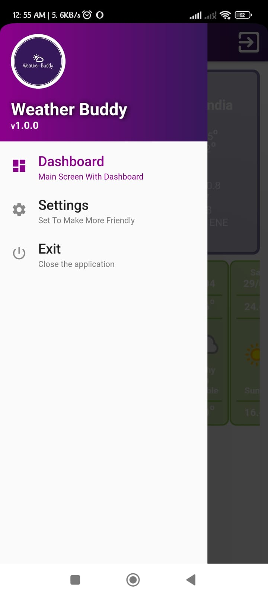
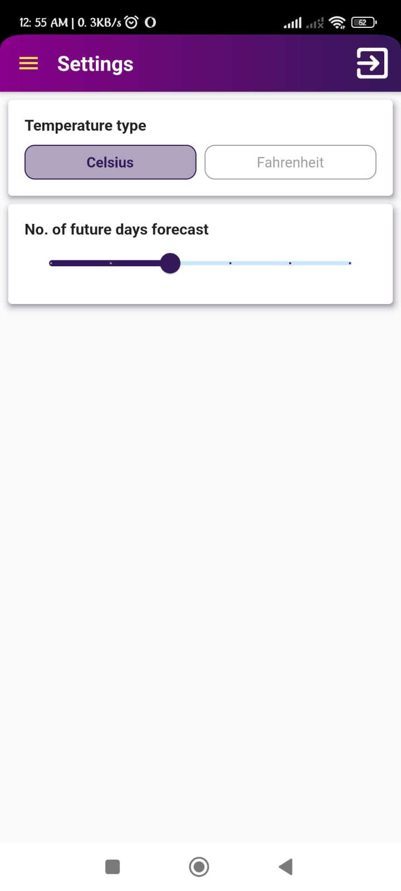
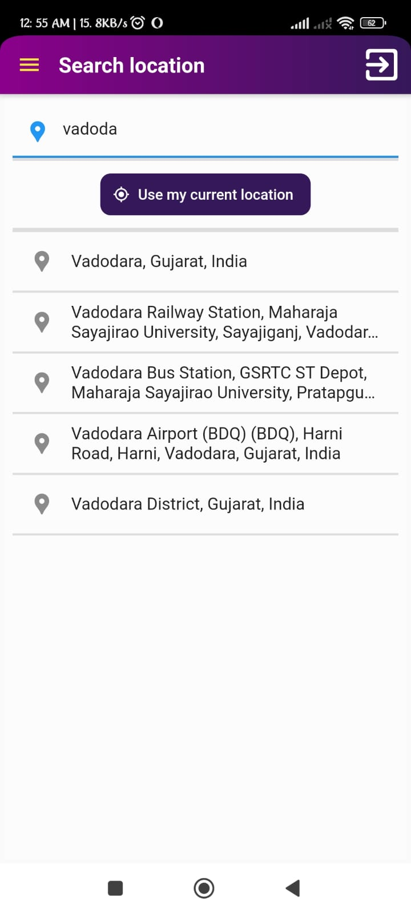
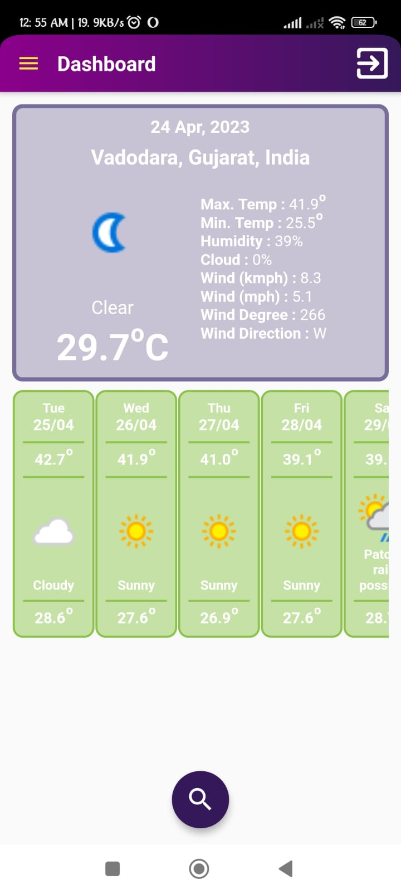
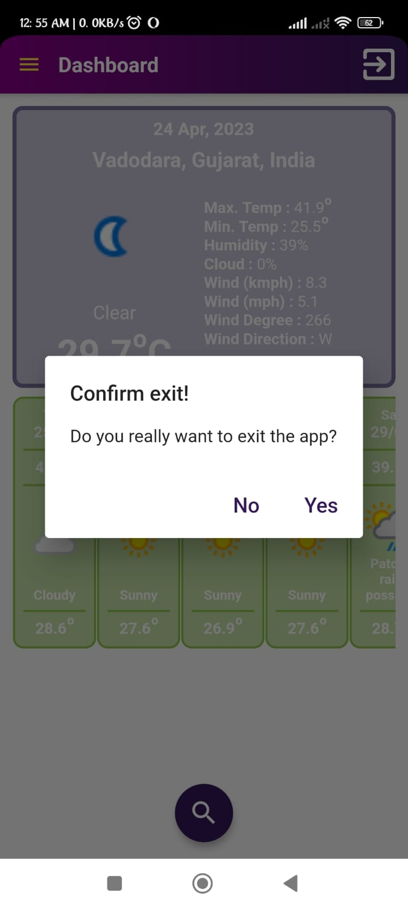

# Weather Buddy

Welcome to my awesome repository! If you find this project useful or interesting, please consider giving it a star ⭐. You can also leave comments or open issues if you have questions or suggestions. Feel free to share this repository with others who might benefit from it. Let's make this project even better together!

## Table of Contents
- [Description](#description)
- [Tools & Technologies](#tools--technologies)
- [Functionalities](#functionalities)
- [User Roles](#user-roles)
- [Pages](#pages)
- [Installation](#installation)
- [Usage](#usage)
- [Screenshots](#screenshots)

## Description

The <strong>Weather Buddy</strong> is a versatile weather forecasting application developed using Flutter and Android Studio, with data storage managed by SQLite. It provides users with a range of features to obtain accurate weather information and forecasts for their desired locations.

## Tools & Technologies

- Android Studio
- Flutter
- SQLite

## Functionalities

- **Drawer Navigation:** Users can easily navigate between the home screen, and settings, and exit the application using the navigation drawer.
- **Temperature Units:** Users have the flexibility to switch between Celsius and Fahrenheit by tapping on today's temperature on the home screen. This setting can also be adjusted in the settings.
- **Future Days Forecast:** Users can customize the number of future days for weather data loading in the settings using a slider, with options ranging from 5 to 10 days.
- **iOS Compatibility:** A separate back button is provided for iOS users, ensuring smooth navigation.
- **Data Refresh:** Users can pull down on the home screen to refresh weather data.
- **Location Search:** The app allows users to search for weather information for any location, including future forecasts.
- **Offline Access:** In the absence of a network connection, the app retrieves data from the local SQLite database if available.
- **Google Places API:** Integration of Google Places API for enhanced location searching and autocomplete functionality.
- **Exception Handling:** The app includes robust exception handling to address network or permission errors.

## User Roles

- **Weather Enthusiasts:** Users interested in accessing accurate weather forecasts for various locations.

## Pages

- **Home Screen:** Displays current weather information and options to switch temperature units and refresh data.
- **Settings:** Allows users to customize temperature units and future days forecast.
- **Location Search:** Enables users to search for weather information for specific locations.

## Installation

1. Unzip the project.
2. Copy and paste the separately attached file 'list_tile.dart' into `C:\src\flutter\packages\flutter\lib\src\material`.
3. Open the file `pubspec.yaml` and click on the `pub get` button at the top right of the file, or open a terminal and execute the command `flutter pub get`.
4. Open a terminal and execute the command `flutter pub run flutter_launcher_icons` to set the application launcher icon.
5. To get the Google Places API key, follow the instructions in the [Google Places API documentation](https://developers.google.com/maps/documentation/places/web-service/overview).
6. To get the Weather Forecast API key, follow the instructions on the [RapidAPI Weather API page](https://rapidapi.com/weatherapi/api/weatherapi-com/).
7. Update both API keys in the file `lib\utils\common_classes.dart` at line numbers 59 and 65.

## Usage

1. Launch the Weather Buddy app.
2. Navigate between the home screen, settings, and location search to access weather information and customize settings.

## Screenshots

	
	
	
	
	
	
	

 

1. Welcome splash screen
2. Dashboard with current location weather details or searched weather details
3. Drawer to navigate through the dashboard and settings or exit the application
4. Set temperature unit and also no. of future days forecast to show on the dashboard
5. Search page to search for any address/location to get their weather details
6. Get the searched location weather details on the dashboard and whenever the application is reopened
7. Popup to confirm exit from application
